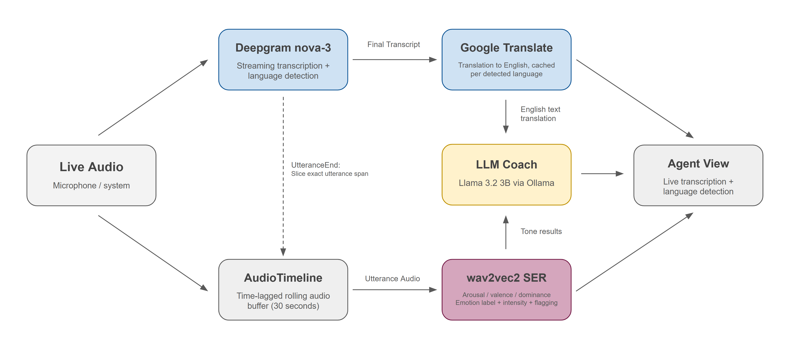

# Inflection — Final Project Report

**DATA/MSML 641 · Summer 2026**
**Team:** Sawyer Bryd, Andrew Liu, Alessandro Vivaldi

---

## Problem and Users

The emotional content of a call is often the first thing lost when providing customer service over linguistic barriers. Our tool aims to bridge the divide created by these barriers in order to provide users with the best customer service possible. Our target user is a customer service agent (QA manager or team lead) at a business process outsourcer (BPO) or international support organization, taking calls from customers who may not be completely fluent in the language spoken by the agent. While translation tools are capable of translating a customer’s words, they are unable to capture any of the emotional context. An agent listening to a translated transcript can’t hear when a customer is getting frustrated, and a manager reviewing calls later reads emotionally neutral text rather than an emotionally charged conversation.

Before a tool like ours, these organizations had to choose between 3 poor options. First, they could have native agents or QA staff for each supported language. While this works, it can be extremely costly and doesn’t scale well to a large number of languages. Second, they could buy enterprise conversation-intelligence platforms like SupportLogic or CallMiner, which are priced for large call centers, meaning that they are unaffordable for smaller-sized operations. Third, they could use other generic translation tools and post-call transcript reviews, completely losing all emotional depth that the conversation had. Our research found that while most tools are sold as “voice sentiment analysis”, they only perform it on the transcript text and ignore the acoustic signals (tone of voice) that transmit emotion across languages. There is no existing tool that does real-time translation with real acoustic sentiment analysis. That combination is the problem Inflection aims to solve.

## Product

Inflection is a real-time, low-cost call companion that transcribes, translates, and reads back customer sentiment as the customer speaks. It runs as a standalone application alongside the agent’s calling software (this could be Zoom, a phone call, or anything that produces audio). As of now, it requires no integration or plugin; it just listens to whatever audio stream is provided. On a call, an agent is able to see the live transcript in the customer’s original language, an English translation, the customer’s current emotional state read from their tone of voice, and a flag when the call shows signs of escalating. An LLM-based “coach” layer is then able to convert these signals into short, actionable feedback for the agent

The system works end-to-end as follows: Two users simultaneously receive the live audio. The first is Deepgram’s nova-3 streaming API, which returns transcripts in real time and automatically detects which of ten supported languages is being spoken (per utterance, with no manual configuration). Non-English transcripts are translated to English using Google Translate, with cached instances of the translator for each detected language. The second consumer is our `AudioTimeline`, a rolling buffer of 30 seconds, where each audio chunk is tagged with the time it was captured. Then, when Deepgram signals the end of an utterance, the pipeline extracts the audio segment corresponding to that utterance from the timeline and passes it to a wav2vec2 speech emotion recognition model, which generates the end emotional reading. This *utterance alignment* is the core design feature in the architecture: sentiment analysis runs once per complete statement, on the audio that statement takes up. This allows for the transcript, translation, and emotion reading to all describe the same speech. Finally, the coach layer (Llama 3.2 3B running locally through Ollama) receives the English translation and tone results to generate brief feedback. All layers run in parallel threads so that no component blocks another.

We chose 2 pivotal design choices that would define our product. We analyze sentiment on the *original-language audio* rather than on translated text. Again, this is because transcriptions lose the emotional information, but acoustic features like tone and speech pacing survive language boundaries. Second, everything possible runs locally and for free. The emotion model and coach LLM are on-device, and hosted components like Deepgram and Google Translate have free tiers. This allows us to keep our product as low-cost as possible and separates Inflection from industry-standard enterprise alternatives.

*The current build is a terminal app using microphone input.*

***Confirm Ollama or OpenAi --> make necessary changes to architecture to account for switch***

## NLP Method and Evaluation

### Models and Pipeline:
Our tool has four NLP components. (1) *Speech recognition and language identification:* Deepgram nova-3 in multi-language streaming mode, transcribing and detecting the spoken language per utterance in ten languages (English, Spanish, French, German, Hindi, Russian, Portuguese, Japanese, Italian, Dutch). (2) *Machine translation:* Google Translate, for the last utterance for non-English speech. (3) *Speech emotion recognition:* audeering's `wav2vec2-large-robust-12-ft-emotion-msp-dim`, a wav2vec2 model fine-tuned for dimensional emotion recognition and whose regression head outputs continuous arousal, valence, and dominance scores. We map these dimensions to readable emotion labels using an octant heuristic: each dimension is bucketed low/neutral/high around a tuned neutral point, and the resulting octant maps to labels like "Angry / Hostile" or "Calm / Neutral", with an intensity score (distance from neutral) and an escalation flag on low-valence, meaningful-intensity readings. If a dimension is in the neutral dead zone, the heuristic deliberately falls back to a more coarse two-axis label instead of producing an overconfident octant. (4) *Text sentiment and coaching:* Llama 3.2 3B, prompted to output a structured sentiment label separately from a short coaching note, so the label is not polluted by advice text.

For clarification, we have not fine-tuned any of the models; our contribution is the real-time composition of each of these components. This includes the utterance-aligned architecture, the label-mapping heuristics, and the acoustic and text sentiment.

### Data:
No training data is needed for the system. For our evaluation stage, we built a synthetic test set containing short utterances produced by a separate LLM, each tagged with a ground-truth emotion from a fixed taxonomy that both the tone model and the coach sentiment output share, at roughly 10-20 utterances per label. The generator’s labels are validated by a human-validated subset before any points are awarded. The test set is not used for any tuning of thresholds or prompts. It is further complemented by natural-speech sessions that have been recorded with native speakers

***recheck: final testing size, per label counts?***

### Baseline and Metrics:
Each stage is scored independently: classification accuracy and a confusion matrix for the wav2vec2 tone pathway alone, and the same for the LLM’s text-sentiment label alone. We compare our fused output to two single-modality systems, which serve as baselines: first a confidence-weighted combination of the two labels, iterated with override rules (e.g., tone wins on disagreement) based on where fusion misses. The evaluation tackles the project’s north-star question: does combining acoustic tone and text sentiment flag emotional state better than either signal alone? 

***Do we have an actual baseline to compare to? → Realistically, rn we have a working product with a justified existence, but is there a naive baseline we could use for this section?***

### Results:

***This is probably the biggest gap as of now.***
***Do we have any anctual accuracies or results to be displayed. Are their any latency measures that could be displayed?***

### Where the System Fails:
Consistent failure modes have been identified in testing to date. The tone model does a good job detecting that emotion is *intense* but occasionally gets the *which* high-intensity emotion wrong, which inspired adding text sentiment as a second signal. In streaming mode, language detection is limited to ten languages; all other speech will default to English handling. Sometimes the translation is wrong, and the coach gets the mistake. The coach per se often times out (20 seconds) on CPU-only machines, disabling feedback on a normal machine. Finally, since sentiment is waiting for the statement to be finished, the readings for long statements are also received late, which is a deliberate tradeoff for the readings that describe complete statements.

## User Evidence
Throughout this semester, we ran two rounds of testing with users outside the team. Mid-semester, moderated sessions with native speakers of Italian and Japanese were held in the terminal environment with a developer moderating five-minute guided conversations, one for each target emotional state. Once up and running, users said the tool was easy to use. There was no need for further configuration, since we had integrated the automatic language detection by that point. Additionally, we confirmed that transcription and translation were holding up in real time, with tone analysis reliably distinguishing high-intensity emotion from neutral speech. They also revealed two findings that influenced the second half of the project, in that tone alone could confuse what strong emotion it was hearing, and that a tool with no UI cannot be operated by an agent realistically.

Both findings altered the product. The weakness of classification directly led to the text-sentiment layer and the fusion-based evaluation plan that now describes our north-star metric. The deadzone fallback labels were added to report ambiguous readings coarsely, rather than confidently wrong. Additionally, subsequent testing of the coach layer revealed a design flaw. The LLM was reading original-language transcripts, so we changed it to the English translation. Small local models understand English much more reliably, preserving accuracy, while the tone analysis still operates on the original audio, so no emotional signal is lost.

In addition to the native speaker sessions, we also performed informal live testing with speakers in natural conversation. We also tested all ten supported languages with AI-generated speech for detection, translation, and end-to-end behavior for languages where there was no native speaker available.

***We could include some quotes from tests here as well / other testing results --> not crucial***

## Ethics and Limitations

### Privacy and consent:
Inflection processes live call audio, which partially belongs to a customer who may not know the tool is running. Deployment must conform to call-recording and wiretap consent laws, which differ by jurisdiction (including two-party consent states), and organizations employing it are responsible for disclosure. Audio and transcripts also leave the device, as the transcription process uses Deepgram’s hosted API and translation uses Google’s service, so customer speech transits third-party infrastructure. We intentionally keep the emotion model and the coach LLM local to limit exposure, but a production version would require data processing agreements and other retention policies.

### Data Rights:
We did not train any models or collect any customer data, and the evaluation uses synthetic utterances specifically to avoid experimenting on real customer conversations. For this project, we used pretrained models, with no way of auditing the training corpora. Our translation path uses an unofficial library that scrapes Google Translate without a formal API agreement.

### Bias:
The intended purpose of Inflection entirely revolves around multilingual use, but the speech emotion model was fine-tuned predominantly on emotional speech in English. Emotional expression varies across languages and cultures. This means that baseline loudness, pace, and animation will often differ across different languages. In turn, the model may systematically misread speakers of some languages as more (or less) agitated than they are. This would be the most serious fairness risk in the system since an escalation flag that is more likely to be triggered by certain accents would directly embed bias into how agents and managers view customers.

### When the model is wrong:
A false escalation flag can cause an agent to overcorrect or a manager to unfairly judge a call. This missed escalation creates false confidence that the call is going well when in reality it is not. Misinformation from mistranslations may also lead to a wrong coaching suggestion that actively degrades a calll. Inflection’s design involves human action in the loop at every step of the process: it informs the agent, never acts autonomously, surfaces low-confidence readings as deliberately coarse labels, and keeps the original transcript visible next to the translation so the agent is never wholly dependent on any single model output. The tool is used to assist judgement of customer service calls.

### Limitations:
The streaming language detection is limited to ten languages. Additionally, system audio capture is Windows-first, and the current build uses microphone input. 
