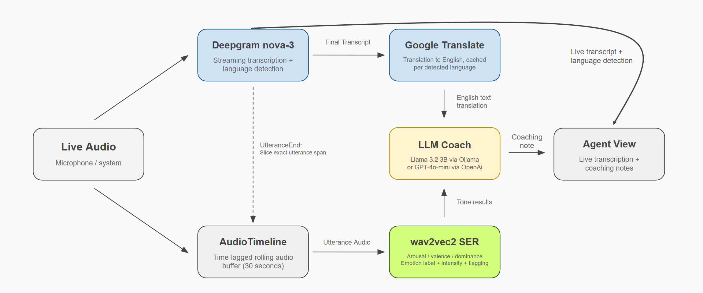
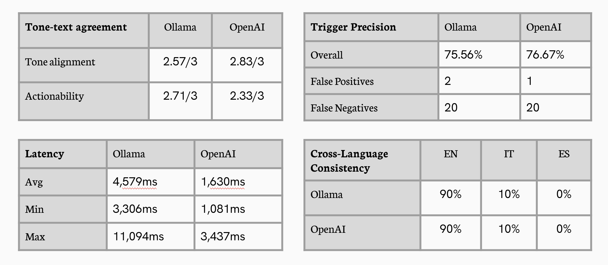

# Inflection — Final Project Report

**DATA/MSML 641 · Summer 2026**
**Team:** Sawyer Bryd, Andrew Liu, Alessandro Vivaldi

---

## Problem and Users

The emotional content of a call is often the first thing lost when providing customer service over linguistic barriers. Our tool aims to bridge the divide created by these barriers in order to provide users with the best customer service possible. Our target user is a customer service agent (QA manager or team lead) at a business process outsourcer (BPO) or international support organization, taking calls from customers who may not be completely fluent in the language spoken by the agent. While translation tools are capable of translating a customer’s words, they are unable to capture any of the emotional context. An agent listening to a translated transcript can’t hear when a customer is getting frustrated, and a manager reviewing calls later reads emotionally neutral text rather than an emotionally charged conversation.

Before a tool like ours, these organizations had to choose between 3 poor options. First, they could have native agents or QA staff for each supported language. While this works, it can be extremely costly and doesn’t scale well to a large number of languages. Second, they could buy enterprise conversation-intelligence platforms like SupportLogic or CallMiner, which are priced for large call centers, meaning that they are unaffordable for smaller-sized operations. Third, they could use other generic translation tools and post-call transcript reviews, completely losing all emotional depth that the conversation had. Our research found that while most tools are sold as “voice sentiment analysis”, they only perform it on the transcript text and ignore the acoustic signals (tone of voice) that transmit emotion across languages. There is no existing tool that does real-time translation with real acoustic sentiment analysis. That combination is the problem Inflection aims to solve.

## Product

Inflection is a real-time, low-cost call companion that transcribes, translates, and reads back customer sentiment as the customer speaks. It runs as a standalone application alongside the agent’s calling software (this could be Zoom, a phone call, or anything that produces audio). As of now, it requires no integration or plugin; it just listens to whatever audio stream is provided. On a call, an agent is able to see the live transcript in the customer’s original language, an English translation, the customer’s current emotional state read from their tone of voice, and a flag when the call shows signs of escalating. An LLM-based “coach” layer is then able to convert these signals into short, actionable feedback for the agent

The system works end-to-end as follows: Two users simultaneously receive the live audio. The first is Deepgram’s nova-3 streaming API, which returns transcripts in real time and automatically detects which of ten supported languages is being spoken (per utterance, with no manual configuration). Non-English transcripts are translated to English using Google Translate, with cached instances of the translator for each detected language. The second consumer is our `AudioTimeline`, a rolling buffer of 30 seconds, where each audio chunk is tagged with the time it was captured. Then, when Deepgram signals the end of an utterance, the pipeline extracts the audio segment corresponding to that utterance from the timeline and passes it to a wav2vec2 speech emotion recognition model, which generates the end emotional reading. This *utterance alignment* is the core design feature in the architecture: sentiment analysis runs once per complete statement, on the audio that statement takes up. This allows for the transcript, translation, and emotion reading to all describe the same speech. Finally, the coach layer (Llama 3.2 3B running locally through Ollama) receives the English translation and tone results to generate brief feedback. All layers run in parallel threads so that no component blocks another.

We chose 2 pivotal design choices that would define our product. We analyze sentiment on the *original-language audio* rather than on translated text. Again, this is because transcriptions lose the emotional information, but acoustic features like tone and speech pacing survive language boundaries. Second, everything possible runs locally and for free. The emotion model and coach LLM are on-device, and hosted components like Deepgram and Google Translate have free tiers. This allows us to keep our product as low-cost as possible and separates Inflection from industry-standard enterprise alternatives.

*The current build is a terminal app using microphone input.*

## NLP Method and Evaluation

### Models and Pipeline:
We built our tool around four key NLP components. (1) *Speech recognition and language identification:* Deepgram nova-3 multi-language, streaming mode, transcribing and language detection in ten languages (English, Spanish, French, German, Hindi, Russian, Portuguese, Japanese, Italian, Dutch). (2) *Machine translation:* Google Translate, for the last utterance in non-English speech (3) *Speech emotion recognition:* audeering's `wav2vec2-large-robust-12-ft-emotion-msp-dim`, a wav2vec2 model fine-tuned for dimensional emotion recognition and with a regression head that outputs continuous arousal, valence and dominance scores. We map these dimensions to human-readable emotion labels using an octant heuristic. Each dimension is categorized as low, neutral, or high based on a tuned neutral point. The resulting octant is then mapped to labels such as “Angry / Hostile” or “Calm / Neutral,” along with an intensity score based on the distance from neutral. An escalation flag is added for readings with low valence and meaningful intensity. If a dimension is in the neutral dead zone, the heuristic deliberately falls back to a coarser two-axis label instead of producing an overconfident octant. (4) *LLM Coaching:* If a hostile utterance is detected, prompt Llama 3.2 3B with the English translation of the transcript and wav2vec2 tone results to generate a short, actionable coaching note for the supervisor (via Ollama or the OpenAI API with GPT-4o-mini).

For clarification, we have not fine tuned any of the models. Our contribution is the real-time composition of each of these components. It includes the utterance aligned architecture, the label-mapping heuristics and threshold tuning for the acoustic tone model.

### Data:
No training data is required for the system. For our evaluation we built a synthetic test set of 90 pre-recorded utterances: 30 sentences in 3 languages (English, Italian, Spanish), covering 3 emotional categories (hostile, neutral, happy), 10 sentences per category per language. Each of the sentences were manually typed out and recorded with text-to-speech (ElevenLabs) with the same emotional delivery across languages to control for speaker variability. At the time of creation, ground-truth labels were assigned by category. We did not tune any thresholds or prompts on the actual test set.

### Baseline and Metrics:
We test the pipeline on two LLM backends: Llama 3.2 3B through Ollama, and GPT-4o-mini through OpenAI API, running the same 90-utterance test set on both. The four measures reported are:

(1) **Tone-text agreement:** manual rubric scoring each coaching note on tone agreement (does the note respond to the detected emotion?) and actionability (is the advice concrete and useful?) on a 1-3 scale on each dimension.

(2) **Coaching trigger precision:** automated comparison of the pipeline's flagging behavior with ground-truth labels, reporting overall accuracy, false positives, false negatives, and breakdown by category and language.

(3) **Processing latency:** time from when all three trigger conditions are met until the coaching note is delivered, isolating the performance of our pipeline from Deepgram transcription and speech duration.

(4) **Cross-language consistency:** hostile flag rate per language, measuring the generalization of the acoustic model across English, Italian and Spanish.

### Results:
We found identical values for trigger precision and cross-language consistency for both LLM backends, confirming that detection behavior is fully determined by wav2vec2, not by the choice of LLM. The overall trigger accuracy was 75.56% (Ollama) and 76.67% (OpenAI). The difference is due to a single discrepancy in false positive. The dominant failure mode was false negatives on non-English hostile speech, with hostile flag rates of 90% for English, 10% for Italian, and 0% for Spanish, indicating a strong English bias in the acoustic model.

OpenAI was rated higher on tone alignment (2.83/3 vs 2.57/3) and Ollama was rated higher on actionability (2.71/3 vs 2.33/3). The most meaningful difference between the two backends was latency: Ollama averaged 4,579ms vs OpenAI’s 1,630ms, making OpenAI about 3x faster for real-time use.

### Where the System Fails:
Testing has revealed consistent failure modes. The acoustic tone model correctly identifies the high intensity of emotions but sometimes gets wrong which high-intensity emotion it is, which suggests adding a text sentiment layer as a future signal. Language detection in streaming mode is limited to ten languages , all other speech is handled in English . Translation errors are propagated to the LLM coach which has no way to detect or recover from them. The acoustic model shows a strong English bias — hostile flag rates drop from 90% in English to 10% in Italian and 0% in Spanish, suggesting that the model was trained mostly on English audio. In the end, since sentiment inference requires an utterance to end, readings for long statements come late, a conscious tradeoff that values complete-utterance accuracy at the expense of speed.

## User Evidence
Throughout this semester, we ran two rounds of testing with users outside the team. Mid-semester, moderated sessions with native speakers of Italian and Japanese were held in the terminal environment with a developer moderating five-minute guided conversations, one for each target emotional state. Once up and running, users said the tool was easy to use. There was no need for further configuration, since we had integrated the automatic language detection by that point. Additionally, we confirmed that transcription and translation were holding up in real time, with tone analysis reliably distinguishing high-intensity emotion from neutral speech. They also revealed two findings that influenced the second half of the project, in that tone alone could confuse what strong emotion it was hearing, and that a tool with no UI cannot be operated by an agent realistically.

Both findings altered the product. The weakness of the tone-only classification was a direct motivation for adding a translation fix to the coach layer and deadzone fallback labels to report ambiguous readings coarsely, not confidently wrong. The deadzone fallback labels were added to report ambiguous readings in a coarse fashion, not in a confidently wrong fashion. Further testing of the coach layer also exposed a design flaw. The LLM was reading the transcripts in the original language, so we translated it into English. The little local models are much better at understanding English, they retain the accuracy but the tone analysis is still done on the original audio so no emotional signal is lost.

In addition to native speaker sessions, we also did informal live testing with speakers in natural conversation. We performed detection, translation and end-to-end behavior on AI-generated speech in three supported languages (English, Italian, Spanish)

## Ethics and Limitations

### Privacy and consent:
Inflection processes live call audio, which partially belongs to a customer who may not know the tool is running. Deployment must conform to call-recording and wiretap consent laws, which differ by jurisdiction (including two-party consent states), and organizations employing it are responsible for disclosure. Audio and transcripts also leave the device, as the transcription process uses Deepgram’s hosted API and translation uses Google’s service, so customer speech transits third-party infrastructure. We intentionally keep the emotion model and the coach LLM local to limit exposure, but a production version would require data processing agreements and other retention policies.

### Data Rights:
We did not train any models or collect any customer data, and the evaluation uses synthetic utterances specifically to avoid experimenting on real customer conversations. For this project, we used pretrained models, with no way of auditing the training corpora. Our translation path uses an unofficial library that scrapes Google Translate without a formal API agreement.

### Bias:
The intended purpose of Inflection entirely revolves around multilingual use, but the speech emotion model was fine-tuned predominantly on emotional speech in English. Emotional expression varies across languages and cultures. This means that baseline loudness, pace, and animation will often differ across different languages. In turn, the model may systematically misread speakers of some languages as more (or less) agitated than they are. This would be the most serious fairness risk in the system since an escalation flag that is more likely to be triggered by certain accents would directly embed bias into how agents and managers view customers.

### When the model is wrong:
A false escalation flag can result in an agent overcorrecting or a manager unfairly judging a call. This missed escalation gives a false impression that the call is going well when in fact it is not. Mistranslations can also lead to misinformation that causes a wrong coaching suggestion that actively degrades a call. The design of inflection includes human action in the loop at every step of the process: it informs the agent, never acts autonomously, surfaces low-confidence readings as deliberately coarse labels, and keeps the original transcript visible next to the translation so the agent is never wholly dependent on any single model output. The tool helps in the judgment of customer service calls.

### Limitations:
The streaming language detection is limited to ten languages. Additionally, system audio capture is Windows-first, and the current build uses microphone input. 
